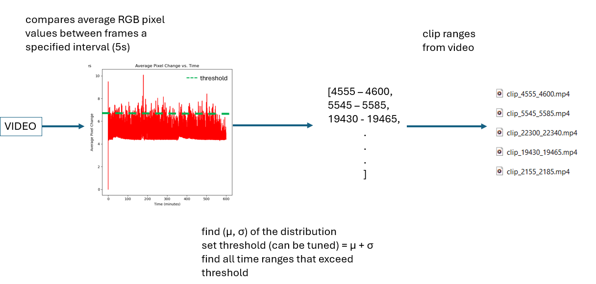
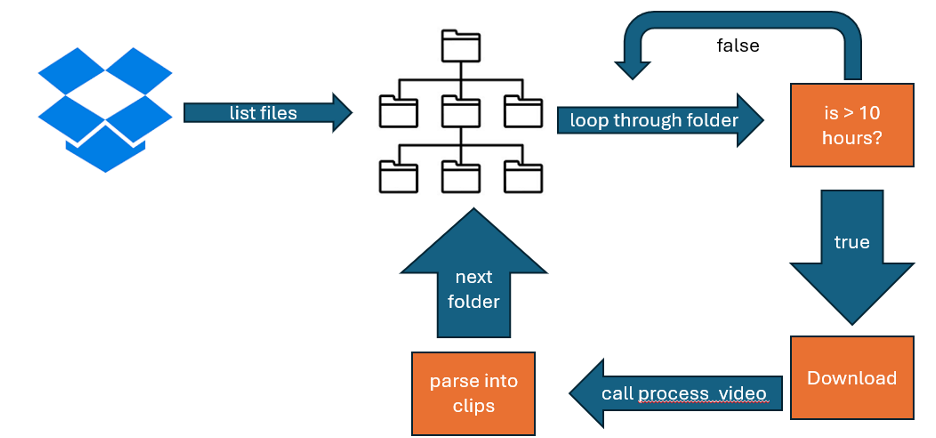
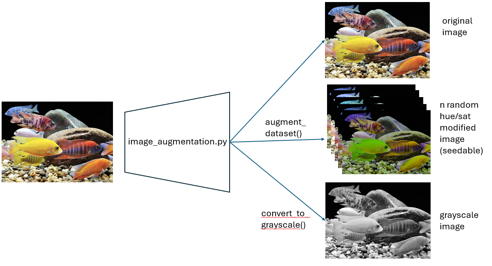

## README - Deeplabcut setup for Cichlid Bower Repository

<!-- omit in toc -->
## Table of Contents
 - [Calculate Average Pixel Changes](#calculate-average-pixel-changes)
 - [Pull And Process](#pull-and-process)
 - [Image Augmentation](#image-augmentation)

 

### Calculate Average Pixel Changes

The goal of this script is to condense a 10 hour video into smaller clips that contain fish
in them. The script works by comparing the average change in pixel values between frames, 
and selecting and cropping out sections of video that have larger changes in pixel values. 
Anecdotablly, this works to roughly get a selection of clips that a fish is present in the 
frame. This can be used in conjunction with Deeplabcut to reduce the processing time needed 
to extract frames from images, or to simply as a preprocessing method to reduce the memory
footprint of the videos to prepare them for other processing methods. 

Make sure to provide a path to the script to process the video, and run 
`python calc_avg_pixel_change.py --help` in order to see the command line options.

### Pull and Process

This script automates the processing of long-duration videos stored in a Dropbox directory
using rclone for file management [setup instructions here](https://www.dropbox.com/scl/fi/e8a42gzt6osowto23hota/Creating-Rclone-remote.docx?rlkey=jd71dx02713p2reucco7w0ob2&dl=0). It lists the video files in each subdirectory, downloads
those exceeding a specified duration (10 hours), processes them to extract shorter clips,
and then deletes the local copies. Files listed in SKIP_FOLDERS are not downloaded.

Usage:

	1. Update Global Variables at top of file, see docstring for variable descriptions
	2. run the script
	3. now you have processed your videos
	4. ???
	5. Profit

**NOTE**: The process_directory assumes the following file structure (note the 'Videos'
folder that contains the actual videos for processing)
ROOT_DIRECTORY/
|___ FOLDERS/
     |___ Videos/
     	|___ <videos_to_process>.mp4
		|___ ...
|___ TO/
     |___ Videos/
     	|___ <videos_to_process>.mp4
		|___ ...
|___ LOOP/
     |___ Videos/
     	|___ <videos_to_process>.mp4
		|___ ...
|___ THROUGH/
     |___ Videos/
     	|___ <videos_to_process>.mp4
		|___ ...

### Image Augmentation

This script performs data augmentation on a dataset of images by applying random color transformations and 
optionally converting the images to grayscale. The purpose is to enhance the dataset for training neural networks, 
ensuring that the network does not rely on the color of the images to make predictions.

Usage:
    
	`python image_augmentation.py input_folder output_folder --num_augmentations 5 --include_grayscale`

Arguments:
* input_folder (str): Path to the input folder containing images.
* output_folder (str): Path to the output folder to save augmented images.
* --num_augmentations (int): Number of augmentations to perform per image (default is 5).
* --include_grayscale (flag): Include grayscale conversion of images if set.

Functions:
* parse_args(): Parses command-line arguments.
* random_color_augmentation(image): Applies random color transformations to an image.
* convert_to_grayscale(image): Converts an image to grayscale.
* augment_dataset(input_folder, output_folder, num_augmentations=5, include_grayscale=False): 
  * Augments the dataset with color transformations and optionally includes grayscale images.
