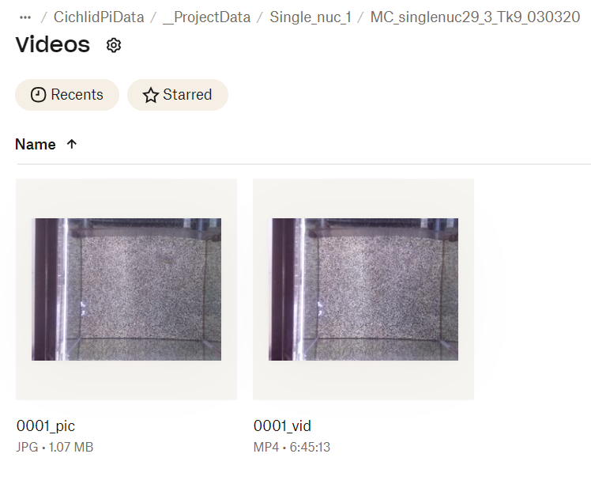
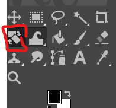
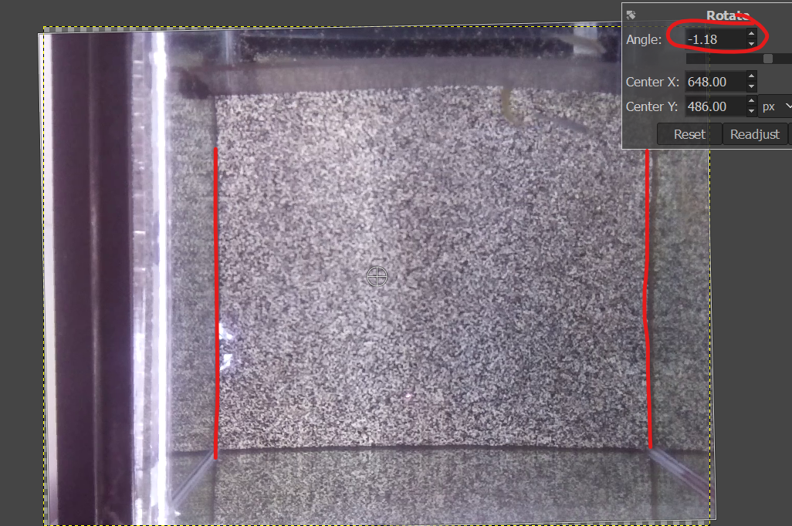
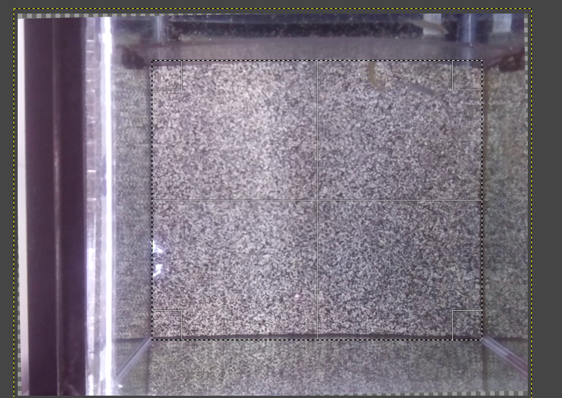

## README - Deeplabcut setup for Cichlid Bower Repository

<!-- omit in toc -->
## Table of Contents
 - [Cropping And Rotation](#cropping-and-rotating)
 - [Calculate Average Pixel Changes](#calculate-average-pixel-changes)
 - [Pull And Process](#pull-and-process)
 - [Image Augmentation](#image-augmentation)

 
### Cropping and rotating
The two scripts `crop_and_rotate_video.py` and `cropping_dataset.py` were created in order to
be used with the cichlid bower tracking repository. In particular `cropping_dataset.py` is
dependent on the folder structure that is created when labelling data in DEEPLABCUT. Click 
[here](#how-to-get-rotation-and-cropping-angles-for-videos) for instructions on how to get
the cropping and rotation angles for a dataset.

### Calculate Average Pixel Changes

The goal of this script is to condense a 10 hour video into smaller clips that contain fish
in them. The script works by comparing the average change in pixel values between frames, 
and selecting and cropping out sections of video that have larger changes in pixel values. 
Anecdotablly, this works to roughly get a selection of clips that a fish is present in the 
frame. This can be used in conjunction with Deeplabcut to reduce the processing time needed 
to extract frames from images, or to simply as a preprocessing method to reduce the memory
footprint of the videos to prepare them for other processing methods. 

Make sure to provide a path to the script to process the video, and run 
`python calc_avg_pixel_change.py --help` in order to see the command line options.

### Pull and Process

This script automates the processing of long-duration videos stored in a Dropbox directory
using rclone for file management [setup instructions here](https://www.dropbox.com/scl/fi/e8a42gzt6osowto23hota/Creating-Rclone-remote.docx?rlkey=jd71dx02713p2reucco7w0ob2&dl=0). It lists the video files in each subdirectory, downloads
those exceeding a specified duration (10 hours), processes them to extract shorter clips,
and then deletes the local copies. Files listed in SKIP_FOLDERS are not downloaded.

Usage:

	1. Update Global Variables at top of file, see docstring for variable descriptions
	2. python pull_and_process.py
	3. now you have processed your videos
	4. ???
	5. Profit

**NOTE**: The process_directory assumes the following file structure (note the 'Videos'
folder that contains the actual videos for processing)\
ROOT_DIRECTORY/\
&nbsp;&nbsp;&nbsp;&nbsp;|___ FOLDERS/\
&nbsp;&nbsp;&nbsp;&nbsp;|&nbsp;&nbsp;&nbsp;&nbsp;|___ Videos/\
&nbsp;&nbsp;&nbsp;&nbsp;|&nbsp;&nbsp;&nbsp;&nbsp;|&nbsp;&nbsp;&nbsp;&nbsp;|___ <videos_to_process>.mp4\
&nbsp;&nbsp;&nbsp;&nbsp;|&nbsp;&nbsp;&nbsp;&nbsp;|&nbsp;&nbsp;&nbsp;&nbsp;|___ ...\
&nbsp;&nbsp;&nbsp;&nbsp;|___ TO/\
&nbsp;&nbsp;&nbsp;&nbsp;|&nbsp;&nbsp;&nbsp;&nbsp;|___ Videos/\
&nbsp;&nbsp;&nbsp;&nbsp;|&nbsp;&nbsp;&nbsp;&nbsp;|&nbsp;&nbsp;&nbsp;&nbsp;|___ <videos_to_process>.mp4\
&nbsp;&nbsp;&nbsp;&nbsp;|&nbsp;&nbsp;&nbsp;&nbsp;|&nbsp;&nbsp;&nbsp;&nbsp;|___ ...\
&nbsp;&nbsp;&nbsp;&nbsp;|___ LOOP/\
&nbsp;&nbsp;&nbsp;&nbsp;|&nbsp;&nbsp;&nbsp;&nbsp;|___ Videos/\
&nbsp;&nbsp;&nbsp;&nbsp;|&nbsp;&nbsp;&nbsp;&nbsp;|&nbsp;&nbsp;&nbsp;&nbsp;|___ <videos_to_process>.mp4\
&nbsp;&nbsp;&nbsp;&nbsp;|&nbsp;&nbsp;&nbsp;&nbsp;|&nbsp;&nbsp;&nbsp;&nbsp;|___ ...\
&nbsp;&nbsp;&nbsp;&nbsp;|___ THROUGH/\
&nbsp;&nbsp;&nbsp;&nbsp;|&nbsp;&nbsp;&nbsp;&nbsp;|___ Videos/\
&nbsp;&nbsp;&nbsp;&nbsp;|&nbsp;&nbsp;&nbsp;&nbsp;|&nbsp;&nbsp;&nbsp;&nbsp;|___ <videos_to_process>.mp4\
&nbsp;&nbsp;&nbsp;&nbsp;|&nbsp;&nbsp;&nbsp;&nbsp;|&nbsp;&nbsp;&nbsp;&nbsp;|___ ...\

### Image Augmentation
\
This script performs data augmentation on a dataset of images by applying random color transformations and 
optionally converting the images to grayscale. The purpose is to enhance the dataset for training neural networks, 
ensuring that the network does not rely on the color of the images to make predictions.

Usage:
    
	`python image_augmentation.py input_folder output_folder --num_augmentations 5 --include_grayscale`

Arguments:
* input_folder (str): Path to the input folder containing images.
* output_folder (str): Path to the output folder to save augmented images.
* --num_augmentations (int): Number of augmentations to perform per image (default is 5).
* --include_grayscale (flag): Include grayscale conversion of images if set.

Functions:
* parse_args(): Parses command-line arguments.
* random_color_augmentation(image): Applies random color transformations to an image.
* convert_to_grayscale(image): Converts an image to grayscale.
* augment_dataset(input_folder, output_folder, num_augmentations=5, include_grayscale=False): 
  * Augments the dataset with color transformations and optionally includes grayscale images.

### How to get rotation and cropping angles for videos
Follow these instructions to get the rotation and cropping angles that remove the tank borders in order to remove fish reflections from the deeplabcut video dataset
1. Navigate to the folder of interest. In this example we will be using the Single_nuc_1 dataset, and in particular the MC_singlenuc29_3_Tk9_030320 trial
2. The Videos/ folder contains the full dataset from each trial, with one image file per video.  

3. Download the image file
4. Download GIMP from link [here](https://www.gimp.org/downloads/)
5. Open in the image in gimp
6. Click the rotate button  

7. rotate the image until the walls of the tank are vertical, and record the rotation angle  

8. Use the rectangle select tool to draw your selection area - crop out the outer walls and just include the sand area   

9. Record the position and size of the box you drew